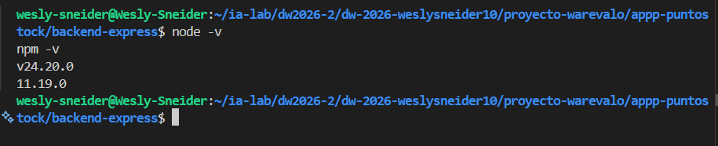
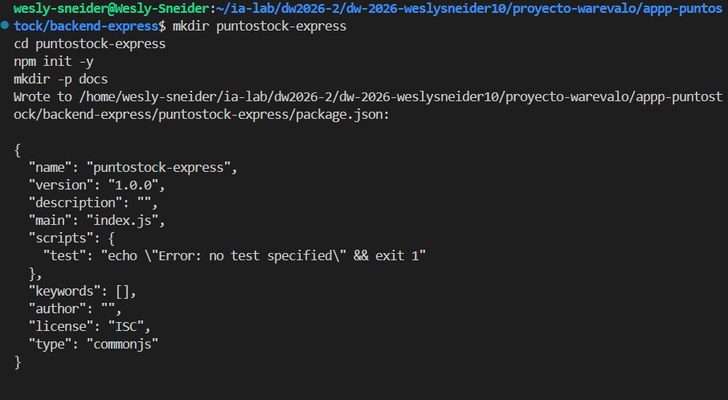
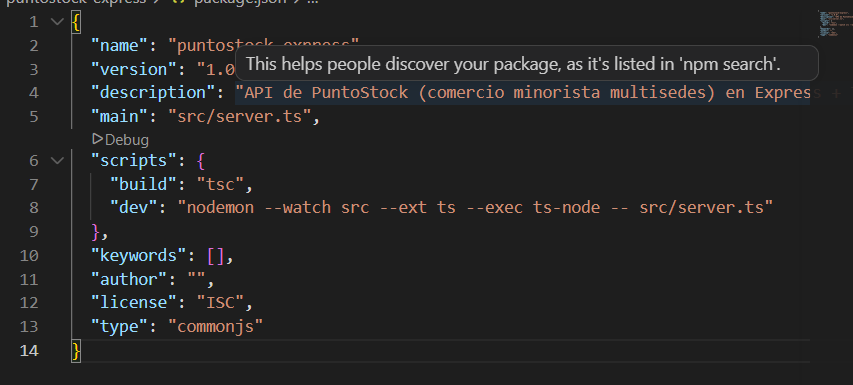
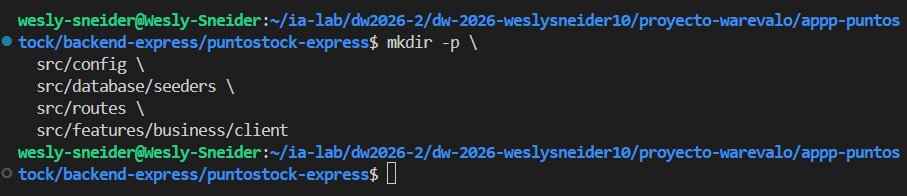
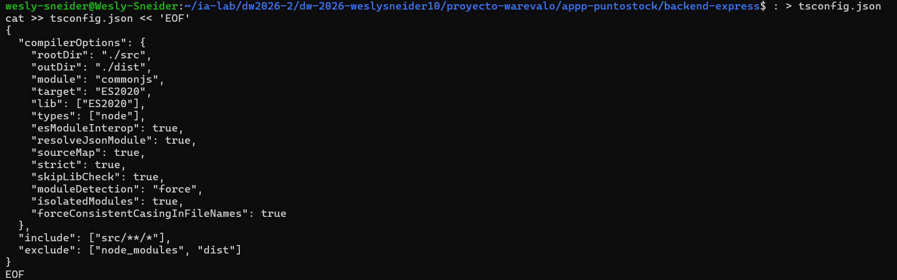
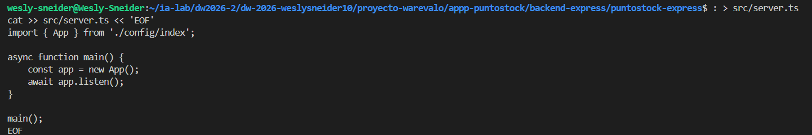

# Manual — backend-express

### ISS-00 — Requisitos previos

Verifica que tengas Node y npm:

### ISS-01 — Esqueleto del proyecto

#### 2.1 Inicializar npm y scripts

### TypeScript (`tsconfig.json`)

### Servidor y App (esqueleto HTTP)

