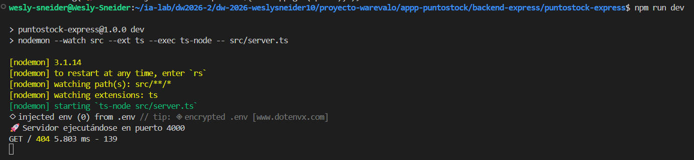
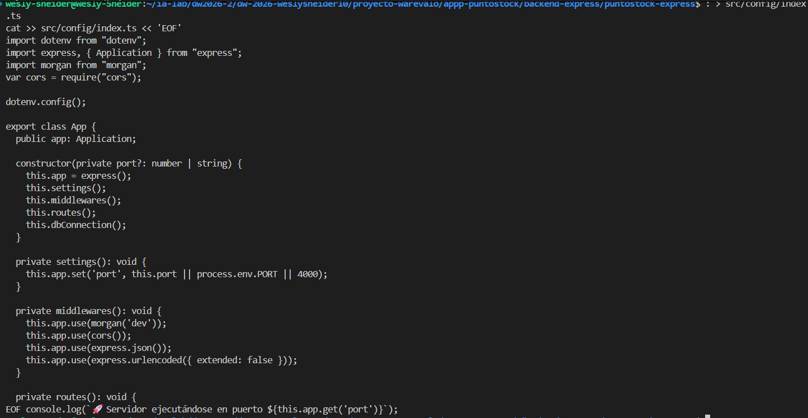

### Manual — backend-express

### ISS-00 — Requisitos previos

### Verifica que tengas Node y npm:

### 

### ISS-01 — Esqueleto del proyecto

### 2.1 Inicializar npm y scripts

### 

### 

### 

### 

### TypeScript (`tsconfig.json`)

### 

### Servidor y App (esqueleto HTTP)

### 

### 

### 

### **2.5.2** — `src/config/index.ts` (esqueleto de App)

###  

### Verificación y cierre de **ISS-01** (`npx tsc --noEmit` + `npm run dev`)

###  

### **3.1** — Drivers Sequelize y `.env` (ISS-02)

###  

### **3.2** — Configuración Sequelize (`src/database/db.ts`)

###  

### **3.3** — Carpeta `seeders/` (reservada, sin lógica aún)

###  

### Verificación y cierre de **ISS-02**

###  

### **4.1** — Modelo `Client` (ISS-03-A)

###  

### **4.2** — Esqueleto `client.controller.ts` / `client.routes.ts` + carpeta `http/`

###  

### **4.3** — Agregador `routes/index.ts` + PARCHE en `config/index.ts` (cablear BD y rutas)

###  

### Verificación y cierre de **ISS-03-A**

###  

### **ISS-03-B** — Controller PARCHE: `getAll` + `getOne`

###  

### **ISS-03-B** — Rutas PARCHE: `GET /api/clientes` + `GET /api/clientes/:id`

###  

### **ISS-03-B** — HTTP: `clients.get.http`

###  

### Verificación y cierre de **ISS-03-B**

###  

### **ISS-03-C** — Controller PARCHE: `create`

###  

### **ISS-03-C** — Rutas PARCHE: `POST /api/clientes`

###  

### **ISS-03-C** — HTTP: `clients.create.http`

###  

### Verificación y cierre de **ISS-03-C**

###  

### **ISS-03-D** — Controller PARCHE: `update` (PUT, reemplazo completo)

###  

### **ISS-03-D** — Controller PARCHE: `update` (PATCH, actualización parcial)
