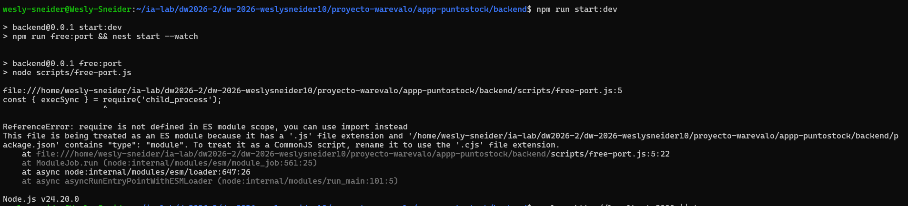

# 

# FASE 1 — \`00_BASE_INIT_NESTJS\`

#  

## 1.1 — Crear carpetas padre y permisos


## 1.2 — Instalar Nest CLI


## 1.3 — Crear proyecto NestJS


## 1.4 — Crear \`.env\` mínimo (puerto)

```         
```


# FASE 2 — \`01_BASE_DEPS_Y_PUERTO\` 

## 2.1 — Dependencias de producción


## 2.2 — Dependencias de desarrollo


## 2.3 — Script para liberar puerto (evita EADDRINUSE)

```         
```


## 2.4 — Actualizar scripts npm en package.json


## 2.5 — Verificar arranque base



# FASE 3 — \`02_BASE_ESTRUCTURA_CA\`

## 3.1 — Crear árbol base de carpetas


