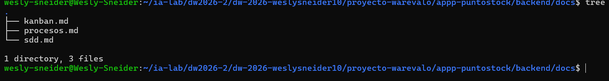
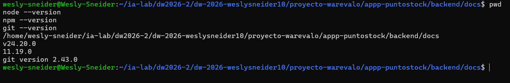
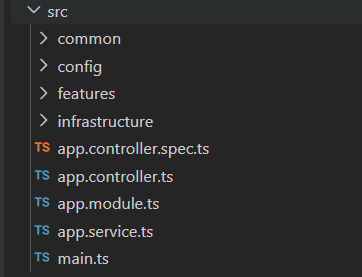

# Manual de construcción manual de PuntoStock con NestJS

> Complementos ejecutables: `00_BASE_ARQUITECTURA_BOOTSTRAP_PUNTOSTOCK.md`, `01_NEGOCIO_CRUD_COMPLETO_PUNTOSTOCK.md`, `02_VENTA_TRANSACCIONAL_PUNTOSTOCK.md`, `03_AUTH_RBAC_COMPLETO_PUNTOSTOCK.md` y `04_VERIFICACION_MANUAL_PUNTOSTOCK.md`. Estos volúmenes contienen el código y la verificación manual que completan esta guía. No incluyen pruebas unitarias automatizadas.

## Semana 04 · MIRIA + SDD + Kanban

Este manual guía la construcción desde WSL de un backend NestJS + Express para el proyecto PuntoStock. La meta no es crear CRUD aislados: se debe demostrar una capacidad funcional integrada, en la que autenticación y RBAC protegen los casos de uso, el catálogo (productos y proveedores) alimenta el inventario por sucursal, el cliente participa en la venta y la venta valida disponibilidad y actualiza el stock de forma atómica.

En esta semana se construye el backend y su primera rebanada vertical. El frontend queda para la Unidad 03. Los motores de base de datos permanecen dockerizados y el backend se conecta por la IP del host, usando un usuario remoto de privilegios mínimos.

## 1. Resultado esperado

Al terminar, el estudiante debe poder demostrar este flujo:

`login → JWT/RBAC → ProductType → Product → Client → Sale + SaleItem → cálculo de total → descuento de stock → respuesta y evidencia`

También debe demostrar los rechazos: `401` sin autenticación, `403` sin permiso, cliente o producto inválido, stock insuficiente y rollback sin datos parciales.

## 2. Preparación MIRIA


Antes de abrir la terminal, registrar en `backend/docs/sdd.md`:

| Elemento | Decisión para PuntoStock |
|---|---|
| M1 | Semana 04: arquitectura por capas y primera capacidad. |
| Objetivo | Construir y explicar una rebanada vertical funcional del backend. |
| Entidades | Sucursal, Producto, Proveedor, Compra, CompraDetalle, Inventario, Cliente, Venta, VentaDetalle, Pago, Devolucion, User, Role, RoleUser, Resource, ResourceRole y RefreshToken. |
| M2 | Campos, invariantes, relaciones, casos de uso, REQ, AC, errores, permisos y contratos. |
| M3 | Issues dependientes, WIP=1, DoR, DoD, pruebas previstas e incidentes. |
| M4 | IA autorizada solo como apoyo; toda salida se revisa, adapta y registra. |
| M5 | Pruebas de dominio, aplicación, adaptadores, API, integración y seguridad. |
| M6 | Gate, evidencias, reflexión y mejora. |

## 3. Crear la carpeta del proyecto en WSL

En WSL, ubícate en la carpeta donde guardas los proyectos y ejecuta:

```bash
mkdir proyecto-warevalo/appp-puntostock
cd proyecto-warevalo/appp-puntostock
mkdir backend
cd backend
mkdir docs
printf '# SDD PuntoStock\\n' > docs/sdd.md
printf '# Kanban PuntoStock\\n' > docs/kanban.md
printf '# Proceso y decisiones\\n' > docs/proceso.md
mkdir evidencias
```


Sustituye `TU_IDENTIFICADOR` por el nombre asignado. No uses espacios ni nombres genéricos como `proyecto-final`.

Registra en `docs/proceso.md` la fecha, distribución de WSL, versión de Node y la salida de cada comando:

```bash
pwd
node --version
npm --version
git --version
```

## 4. Abrir el backend NestJS existente

El backend ya está creado en el proyecto real. No ejecutes `nest new` ni crees otra carpeta:

```bash
cd ~ia-lab/dw2026-2/dw-2026-weslysneider10/proyecto-warevalo/appp-puntostock/backend
npm install
npm run start:dev
```

Abre otra terminal WSL y verifica:

```bash
curl http://localhost:3000/api/docs
```

Detén el servidor con `Ctrl+C` y registra si la respuesta fue correcta. El backend no se instala en Docker.

## 5. Instalar dependencias del backend

Usaremos Sequelize como ORM y `sequelize-typescript` para mapear modelos TypeScript. El motor se selecciona mediante `DB_DIALECT` en `.env`; el mismo backend puede trabajar con MySQL, PostgreSQL, Microsoft SQL Server u Oracle sin cambiar el dominio ni los casos de uso.

```bash
npm install @nestjs/config @nestjs/sequelize sequelize sequelize-typescript class-validator class-transformer
npm install @nestjs/swagger swagger-ui-express helmet
npm install @nestjs/jwt passport passport-jwt @nestjs/passport bcrypt
npm install --save-dev @types/bcrypt @types/passport-jwt
```

Controlador según motor:

```bash
# MySQL
npm install mysql2

# PostgreSQL
npm install pg

# Microsoft SQL Server (conector usado por Sequelize)
npm install tedious

# Oracle
npm install oracledb
```

Instala el controlador correspondiente al motor elegido; en una instalación real no es obligatorio instalar los cuatro. Para Oracle, `oracledb` puede requerir las bibliotecas cliente de Oracle en WSL según el modo de conexión.

Registra en `docs/proceso.md` la opción escogida y justifica por qué corresponde al motor de la Semana 02.

## 6. Configurar la conexión remota a la base de datos

Crea `.env.example` y copia una versión local:

```bash
cat > .env.example <<'EOF'
APP_PORT=3000
DB_DIALECT=mysql
DB_HOST=IP_DEL_HOST
DB_PORT=3306
DB_USERNAME=usuario_remoto
DB_PASSWORD=CAMBIAR_LOCALMENTE
DB_NAME=storelab
DB_SCHEMA=
DB_CONNECT_STRING=
JWT_SECRET=CAMBIAR_LOCALMENTE
JWT_EXPIRES_IN=15m
EOF
cp .env.example .env
```

Edita `.env` con la IP real del host, el motor y el puerto correspondiente. Valores válidos para `DB_DIALECT`: `mysql`, `postgres`, `mssql` u `oracle`. En Oracle, `DB_CONNECT_STRING` puede contener el servicio o connect descriptor requerido por el listener.

```env
# Selecciona un solo bloque según el motor asignado
DB_DIALECT=mysql
DB_PORT=3306
# DB_DIALECT=postgres
# DB_PORT=5432
# DB_DIALECT=mssql
# DB_PORT=1433
# DB_DIALECT=oracle
# DB_PORT=1521
```

No publiques `.env` ni escribas contraseñas en la bitácora:

```bash
printf '\n.env\n' >> .gitignore
```

Prueba la conectividad desde WSL con el cliente disponible para tu motor. Si falla, revisa primero IP, puerto, usuario remoto, firewall y configuración de red del contenedor. No cambies código NestJS para ocultar un problema de red.

## 7. Organizar la arquitectura por capas

La estructura física obligatoria de `src/` es la siguiente. No se debe sustituir por `modules/`, `src/database/` ni por carpetas globales que dispersen las entidades:

```text
src/
├── main.ts
├── app.module.ts
├── config/                 # app, database, environment, jwt, logger, swagger
├── common/                 # constants, decorators, enums, exceptions, filters,
│                           # guards, interceptors, interfaces, pipes, utils
├── infrastructure/
│   ├── database/
│   │   ├── sequelize/      # factory + module; registra TODOS los modelos
│   │   └── seeders/        # bootstrap ordenado Business -> Auth
│   └── security/           # hashing bcrypt + tokens JWT
└── features/
    ├── business/
    │   ├── branches/        # Sucursal
    │   ├── products/        # Producto
    │   ├── suppliers/        # Proveedor
    │   ├── purchasing/       # Compra + CompraDetalle (pivote)
    │   ├── inventory/        # Inventario (Sucursal N:M Producto)
    │   ├── clients/          # Cliente
    │   ├── sales/            # Venta + VentaDetalle (pivote)
    │   ├── payments/         # Pago
    │   ├── returns/          # Devolucion
    │   └── business.module.ts
    └── auth/
        ├── users/
        ├── roles/
        ├── role-users/
        ├── resources/
        ├── resource-roles/
        ├── refresh-tokens/
        ├── authentication/ # login / refresh / logout
        └── auth.module.ts
```

Cada entidad o capacidad debe tener esta estructura interna:

```text
nombre-entidad/
├── application/
│   ├── dto/
│   ├── mappers/
│   └── use-cases/
├── domain/
│   ├── entities/
│   ├── enums/
│   ├── exceptions/
│   ├── interfaces/
│   ├── services/
│   └── validators/
├── infrastructure/
│   └── persistence/
│       ├── models/
│       ├── repositories/
│       ├── migrations/
│       └── seeders/
├── presentation/
│   └── http/
│       ├── controllers/
│       ├── decorators/
│       ├── serializers/
│       └── swagger/
├── tests/
└── nombre-entidad.module.ts
```

Comandos base en WSL:

```bash
mkdir -p src/config/{app,database,environment,jwt,logger,swagger}
mkdir -p src/common/{constants,decorators,enums,exceptions,filters,guards,interceptors,interfaces,pipes,utils,validators}
mkdir -p src/infrastructure/database/{sequelize,seeders,migrations}
mkdir -p src/infrastructure/security
mkdir -p src/features/business/{branches,products,suppliers,purchasing,inventory,clients,sales,payments,returns}/{application/{dto,mappers,use-cases},domain/{entities,enums,exceptions,interfaces,services,validators},infrastructure/persistence/{models,repositories,migrations,seeders},presentation/http/{controllers,decorators,serializers,swagger},tests}
mkdir -p src/features/auth/{users,roles,role-users,resources,resource-roles,refresh-tokens}/{application/{dto,mappers,use-cases},domain/{entities,enums,exceptions,interfaces,services,validators},infrastructure/persistence/{models,repositories,migrations,seeders},presentation/http/{controllers,decorators,serializers,swagger},tests}
mkdir -p src/features/auth/authentication/{application/{dto,mappers,use-cases},domain/{entities,enums,exceptions,interfaces,services,validators},infrastructure/persistence/{models,repositories,migrations,seeders},presentation/http/{controllers,decorators,serializers,swagger},tests}
touch src/features/business/business.module.ts src/features/auth/auth.module.ts
```


Regla de dependencia: `presentation -> application -> domain`. `infrastructure` implementa los puertos definidos por Application/Domain; allí viven los modelos, repositorios, migraciones y transacciones Sequelize. El dominio no importa NestJS, Sequelize, HTTP ni variables de entorno.

En el dominio, el concepto de línea de compra se llama `PurchaseItem`; en el modelo Sequelize del prompt completo se persiste como `CompraDetalle`. Son el mismo concepto y deben documentarse como `PurchaseItem/CompraDetalle`, sin crear dos tablas distintas.

De la misma forma, el concepto de línea de venta se llama `SaleItem`; en el modelo Sequelize se persiste como `VentaDetalle`. Deben documentarse como `SaleItem/VentaDetalle`, sin crear dos tablas distintas.

El dominio no importa NestJS, Sequelize, HTTP ni variables de entorno. Los DTO, controladores, modelos Sequelize, repositorios ORM y guards pertenecen a las capas externas.
## 8. Crear la base técnica antes del negocio

Genera configuración, salud y documentación:

```bash
nest g module config
nest g module infrastructure/database/sequelize
nest g controller health
nest g service health
```

En `src/app.module.ts` importa `ConfigModule.forRoot({ isGlobal: true })` y `SequelizeModule.forRootAsync(...)`. Configura `dialect` con el valor validado de `DB_DIALECT`, además de `host`, `port`, `username` (proveniente de `DB_USERNAME`), `password`, `database`, `models` y `autoLoadModels: true`. No permitas que un valor arbitrario llegue al constructor: valida la lista de dialectos al arrancar. En desarrollo puede usarse `synchronize: true` solo si la decisión está registrada; para datos importantes usa migraciones con Sequelize CLI.

Ejemplo de configuración centralizada:

```ts
const allowed = ['mysql', 'postgres', 'mssql', 'oracle'] as const;
const dialect = config.get<string>('DB_DIALECT');
if (!dialect || !allowed.includes(dialect as typeof allowed[number])) {
  throw new Error('DB_DIALECT debe ser mysql, postgres, mssql u oracle');
}
return {
  dialect,
  host: config.getOrThrow<string>('DB_HOST'),
  port: Number(config.getOrThrow<string>('DB_PORT')),
  username: config.getOrThrow<string>('DB_USERNAME'),
  password: config.getOrThrow<string>('DB_PASSWORD'),
  database: config.getOrThrow<string>('DB_NAME'),
  autoLoadModels: true,
  synchronize: false,
};
```

El tipado final de `dialect` debe ajustarse a la versión instalada de Sequelize; conserva la validación en tiempo de ejecución.

En `src/main.ts` configura:

```ts
app.setGlobalPrefix('api');
app.use(helmet());
app.useGlobalPipes(new ValidationPipe({ whitelist: true, forbidNonWhitelisted: true, transform: true }));
```

Agrega Swagger en `/api/docs` y un endpoint `GET /api/health` que responda estado de aplicación y base de datos sin exponer secretos.

Verifica:

```bash
npm run start:dev
curl http://localhost:3000/api/health
```

## 9. Modelar el dominio completo

Registra estas entidades y reglas en `docs/sdd.md` antes de crear tablas:

| Grupo | Entidades | Reglas esenciales |
|---|---|---|
| Negocio | Client, ProductType, Product | Cliente válido; tipo activo; precio > 0; stock y stock mínimo ≥ 0; stock nunca negativo. |
| Venta | Sale, SaleItem | Al menos un ítem; total calculado por servidor; cantidad y precio > 0; descuento de stock atómico. |
| Identidad | User, RefreshToken | Email/usuario únicos; contraseña con hash; token expirado o revocado no sirve; nunca devolver hash. |
| Autorización | Role, RoleUser, Resource, ResourceRole | Asociaciones únicas y activas; solo una cadena activa concede permiso. |

Relaciones mínimas: `ProductType 1:N Product`, `Client 1:N Sale`, `Sale 1:N SaleItem`, `Product 1:N SaleItem`, `User N:M Role por RoleUser`, `Role N:M Resource por ResourceRole`, `User 1:N RefreshToken`.

## 10. Construir por incrementos, no por CRUD repetido

### Incremento A — Client

```bash
nest g module features/business/clients
nest g controller features/business/clients/presentation/http/controllers/clients
nest g service features/business/clients/application/use-cases/clients
```

Implementa entidad de dominio, puerto de repositorio, caso de uso de crear/consultar, adaptador Sequelize, DTO y controlador. Valida nombre obligatorio, email/teléfono con formato y unicidad cuando aplique. Prueba éxito y datos inválidos.

### Incremento B — ProductType y Product

Implementa primero ProductType y luego Product. El caso de uso de Product debe comprobar que el tipo existe y está activo. No permitas crear un producto huérfano. Prueba precio cero, stock negativo, tipo inexistente y tipo inactivo.

### Incremento C — SaleItem y Sale

Sale es un agregado: recibe cliente e ítems, valida referencias, calcula importes y coordina el descuento de stock. El precio utilizado debe quedar congelado en SaleItem; no lo tomes de una operación posterior del frontend.

Implementa una transacción en el adaptador de infraestructura. Si falla la validación de un ítem o el stock no alcanza, no debe persistirse ni la venta, ni sus detalles, ni el descuento parcial.

### Incremento D — identidad y RBAC

Implementa en este orden: User, Role, RoleUser, Resource, ResourceRole y RefreshToken. Después crea login, refresh, logout y `me`. La autenticación identifica; RBAC decide si el actor puede ejecutar el caso de uso.

El guard debe comprobar: JWT válido, usuario activo, rol activo, asociación RoleUser activa, recurso activo y asociación ResourceRole activa. Demuestra `401`, `403` y acceso permitido.

## 11. Generar código de forma controlada

Para cada entidad repite este ciclo manual:

1. Escribe la ficha SDD.
2. Define el REQ y los AC.
3. Crea el Issue y sus dependencias.
4. Implementa primero reglas de dominio.
5. Implementa el caso de uso.
6. Define el puerto.
7. Implementa el adaptador Sequelize.
8. Expón DTO y endpoint.
9. Ejecuta pruebas de éxito y error.
10. Guarda captura, log, commit y decisión en `docs/evidencias/`.

No copies la misma plantilla de CRUD sin revisar las reglas particulares de cada entidad.

## 12. Contratos mínimos de la rebanada vertical

Documenta en `docs/contratos.md` al menos:

| Operación | Método y ruta | Resultado |
|---|---|---|
| Salud | `GET /api/health` | Estado sin secretos. |
| Login | `POST /api/auth/login` | Access token y refresh token seguro. |
| Crear tipo | `POST /api/product-types` | Solo actor autorizado. |
| Crear producto | `POST /api/products` | Requiere tipo activo. |
| Crear cliente | `POST /api/clients` | Valida datos y permisos. |
| Crear venta | `POST /api/sales` | Valida agregado y descuenta stock. |
| Consultar usuario | `GET /api/auth/me` | No devuelve contraseña ni hash. |

Todos los errores deben tener una forma consistente; el cliente no decide total, permisos ni stock.

## 13. Prueba completa obligatoria

Prepara datos de prueba y ejecuta:

1. Crear usuario y asignarle rol activo.
2. Asignar el recurso correspondiente al rol.
3. Iniciar sesión y obtener JWT.
4. Crear ProductType activo.
5. Crear Product con stock válido.
6. Crear Client.
7. Crear Sale con uno o más SaleItem.
8. Comprobar total, venta persistida, detalles y stock reducido.
9. Repetir con stock insuficiente y comprobar rollback.
10. Repetir sin token y comprobar `401`.
11. Repetir con rol sin recurso y comprobar `403`.

Guarda request, respuesta, estado previo/posterior del stock y resultado de pruebas. Esa secuencia es la evidencia de proyecto funcional.

## 14. Cierre MIRIA y Gate

Antes de mover una tarjeta a `Aceptada/Evidenciada`, revisa:

- todas las entidades están ubicadas en el mapa y sus relaciones se usan;
- cada REQ tiene AC, Issue, prueba y EVI;
- el flujo integrado funciona de extremo a extremo;
- la venta es transaccional y no deja stock negativo;
- JWT/RBAC diferencia `401` y `403`;
- no hay secretos ni hashes en respuestas o commits;
- se registró qué apoyo de IA se usó, qué se modificó y por qué;
- el estudiante puede explicar el código y reproducirlo desde WSL.

Si falla un criterio, la tarjeta vuelve a `En ajustes`; no se acepta un CRUD aislado como producto terminado.
