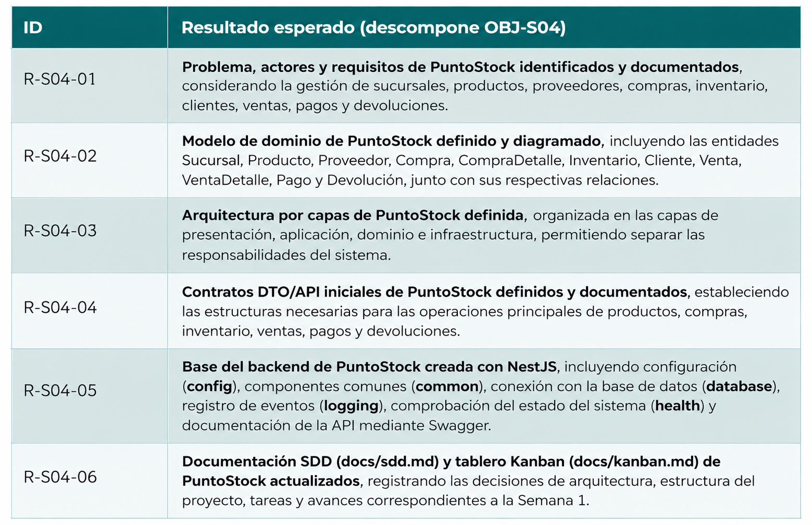

# Proceso paso a paso DW
## Semana 4
## 1. Identificación del problema

Actualmente, el comercio minorista PuntoStock presenta dificultades para gestionar de manera organizada y centralizada sus operaciones de compras, ventas e inventario en las diferentes sucursales. La información se maneja en registros separados, lo que puede ocasionar inconsistencias en las existencias y dificultades para conocer la cantidad real de productos disponibles en cada ubicación.

Además, no existe un control adecuado que permita evitar la venta de productos cuando no hay disponibilidad suficiente, registrar correctamente las compras y sus recepciones parciales, gestionar devoluciones y controlar diferentes métodos de pago. Esta situación dificulta el seguimiento de las operaciones y la toma de decisiones relacionadas con la reposición de productos, los márgenes y la rotación del inventario.

Por esta razón, se plantea desarrollar **PuntoStock**, un sistema que permita centralizar y organizar la información de productos, proveedores, compras, inventarios, clientes, ventas, pagos y devoluciones, facilitando el control de las operaciones del comercio en sus diferentes sucursales.

---

## 2. Objetivos

### 2.1 Objetivo general

Comprender y definir el dominio y la arquitectura del proyecto **PuntoStock**, identificando el problema, los actores, requisitos, entidades y relaciones del sistema; estableciendo una arquitectura por capas y los contratos iniciales mediante DTO/API, y dejando estructurada la base del backend en **NestJS**, incluyendo la configuración, componentes comunes, conexión con la base de datos, logging, health check y documentación mediante Swagger.

### 2.2 Objetivos específicos

- Diseñar un sistema que permita administrar los productos y su información básica, incluyendo SKU, nombre, descripción, precio y estado.

- Gestionar las diferentes sucursales y controlar las existencias de productos de manera independiente en cada ubicación.

- Registrar y administrar proveedores y las compras realizadas al comercio.

- Controlar el inventario disponible y establecer cantidades mínimas para generar alertas de reposición.

- Registrar las ventas realizadas a los clientes y controlar la disponibilidad de los productos antes de realizar una venta.

- Permitir el registro de diferentes métodos de pago asociados a las ventas.

- Gestionar las devoluciones relacionadas con las ventas realizadas.

- Centralizar la información de las operaciones comerciales para facilitar su consulta y seguimiento.

- Diseñar una arquitectura backend modular y por capas que permita mantener y ampliar el sistema en futuras etapas.

- Documentar los servicios del sistema mediante una API estructurada y Swagger.

## 3. Resultados esperados - Semana 1

 
  

## 4. SPEC semanal — SPEC-S04 y requisitos (Momento 2 · Especificación SDD)

La SPEC traduce OBJ-SNN en una definición acotada de lo que deberá construirse, configurarse o demostrarse.

**SPEC-S04 (docente, StoreLab):** modelar el dominio StoreLab (clientes, tipos de producto, productos y ventas con RBAC transversal), definir la arquitectura cliente-servidor y por capas (presentation/application/domain/infrastructure), establecer los contratos iniciales y crear la base del backend NestJS (config, common, database, logging, health y Swagger) sin frontend. Todo queda documentado en `docs/sdd.md` y `docs/kanban.md`.

**SPEC-S04 (estudiante, PuntoStock):** modelar el dominio de PuntoStock (sucursales, proveedores, productos, compras, inventario por ubicación, clientes, ventas, pagos y devoluciones, con RBAC transversal), definir la arquitectura cliente-servidor y por capas (presentation/application/domain/infrastructure), establecer los contratos iniciales y crear la base del backend NestJS (config, common, database, logging, health y Swagger) sin frontend. Todo queda documentado en `docs/sdd.md` y `docs/kanban.md`.

**Requisitos derivados:**

| ID | Requisito |
|---|---|
| REQ-S04-01 | Problema, actores y requisitos del dominio de PuntoStock documentados (`docs/sdd.md`). |
| REQ-S04-02 | Modelo de dominio con entidades (Sucursal, Producto, Proveedor, Compra, CompraDetalle, Inventario, Cliente, Venta, VentaDetalle, Pago, Devolucion) y relaciones definido y diagramado. |
| REQ-S04-03 | Arquitectura por capas definida y explicada (presentation/application/domain/infrastructure). |
| REQ-S04-04 | Contratos (DTO/API) iniciales definidos y documentados (ej. `POST /compras`, `POST /ventas`, `POST /devoluciones`, `GET /inventarios`). |
| REQ-S04-05 | Base del backend NestJS operativa: config, common, database, logging, health, Swagger. |
| REQ-S04-06 | `docs/sdd.md` y `docs/kanban.md` del proyecto PuntoStock actualizados con trazabilidad. |

## 5. Criterios de aceptación y evidencia esperada (Momento 2 · Especificación SDD)

| ID | Criterio de aceptación | Evidencia |
|---|---|---|
| AC-S04-01 | Documento con problema, actores y requisitos del dominio de PuntoStock. | EVI-S04-01 (docs/sdd.md) |
| AC-S04-02 | Diagrama del modelo de dominio de PuntoStock (entidades, relaciones, agregado). | EVI-S04-02 (diagrama) |
| AC-S04-03 | Diagrama de arquitectura por capas con responsabilidades. | EVI-S04-03 (diagrama) |
| AC-S04-04 | Contratos definidos (DTO/API) con ejemplo de request/response (ej. `POST /ventas`). | EVI-S04-04 (docs/contratos) |
| AC-S04-05 | Backend NestJS arranca; `/health` responde; Swagger accesible. | EVI-S04-05 (captura + `/health`) |
| AC-S04-06 | `docs/sdd.md` y `docs/kanban.md` reflejan OBJ/SPEC/REQ/AC/Issues. | EVI-S04-06 (archivos) |

**Criterios de calidad comunes:** dominio y arquitectura expresados en el lenguaje del negocio de PuntoStock (sucursales, compras, inventario, ventas); capas con responsabilidades claras; contratos consistentes con el modelo de dominio; backend arranca en WSL sin Docker para el framework; secretos excluidos; evidencia legible y trazable.

---

## 6. Matriz de trazabilidad (Momento 2 · Especificación SDD)

| OBJ | SPEC | REQ | AC | Issue | Evidencia |
|---|---|---|---|---|---|
| OBJ-S04 | SPEC-S04 | REQ-S04-01 | AC-S04-01 | #01 | EVI-S04-01 |
| OBJ-S04 | SPEC-S04 | REQ-S04-02 | AC-S04-02 | #02 | EVI-S04-02 |
| OBJ-S04 | SPEC-S04 | REQ-S04-03 | AC-S04-03 | #03 | EVI-S04-03 |
| OBJ-S04 | SPEC-S04 | REQ-S04-04 | AC-S04-04 | #04 | EVI-S04-04 |
| OBJ-S04 | SPEC-S04 | REQ-S04-05 | AC-S04-05 | #05 | EVI-S04-05 |
| OBJ-S04 | SPEC-S04 | REQ-S04-06 | AC-S04-06 | #06 | EVI-S04-06 |

---

## 7. Issues de la semana — Momento 3 · Organización Kanban

| Issue | Descripción | REQ | DoR (entrada) | DoD (salida) |
|---|---|---|---|---|
| #01 | Documentar problema, actores y requisitos del dominio de PuntoStock | REQ-01 | Proyecto asignado (S01) | `docs/sdd.md` con dominio |
| #02 | Modelar dominio: Sucursal, Producto, Proveedor, Compra, CompraDetalle, Inventario, Cliente, Venta, VentaDetalle, Pago, Devolucion | REQ-02 | Requisitos definidos (#01) | Diagrama de dominio |
| #03 | Definir arquitectura por capas | REQ-03 | Modelo de dominio (#02) | Diagrama de arquitectura |
| #04 | Definir contratos (DTO/API) | REQ-04 | Modelo de dominio (#02) | Contratos documentados |
| #05 | Crear base del backend NestJS | REQ-05 | Node LTS + npm (S03) | Backend arranca + `/health` |
| #06 | Actualizar `docs/sdd.md` y `docs/kanban.md` | REQ-06 | #01–#05 | SDD + Kanban trazables |

---

## 8. Dependencias entre Issues — Momento 3 · Organización Kanban

**Ruta crítica o secuencia mínima:** #01 (dominio/requisitos) → #02 (modelo) → #03 (arquitectura) y #04 (contratos) en paralelo; #05 (backend base) requiere Node de S03; #06 (docs) depende de #01–#05. Todo converge en GATE-S04.

**Bloqueos / riesgos principales y plan alterno:**

| Bloqueo / riesgo | Plan alterno |
|---|---|
| No se comprende el dominio de PuntoStock (compras, inventario multisede, ventas, devoluciones, pagos mixtos) | Releer la narrativa del proyecto y resolver dudas con el docente/IA al inicio. |
| Base de código previa inexistente | Definir primero arquitectura y contratos antes de implementar. |
| NestJS no arranca por configuraciones | Verificar Node/npm, dependencias y documentar en bitácora. |
| Conexión remota a BD pendiente | Se aborda en semana 5; esta semana solo se deja config/database listos. |

---

## 9. Kanban semanal — Momento 3 · Organización Kanban

**Política del tablero:** WIP = 1 por estudiante: solo una Issue en «En desarrollo». «Bloqueado» es un indicador visible sobre una tarjeta, no una columna.

| Columna | Significado | Política de entrada / salida |
|---|---|---|
| Por especificar | Necesidad vinculada a un resultado de aprendizaje. | Sale al completar la especificación SDD. |
| Especificada | OBJ/SPEC/REQ/AC y fuentes definidos. | Sale con aprobación docente (DoR) para iniciar. |
| En desarrollo | Unidad de trabajo dentro del WIP acordado. | Sale con cambio versionado, prueba y evidencia. |
| En revisión humana | Entrega presentada con evidencia. | Sale sin hallazgos bloqueantes. |
| En ajustes | Hallazgos registrados en la revisión. | Sale con correcciones trazables y verificación superada. |
| Aceptada/Evidenciada | Criterios de finalización (DoD) cumplidos. | Evidencia vinculada y decisión de cierre. |

| Issue | Columna inicial | Responsable | Bloqueado | Motivo / acción |
|---|---|---|---|---|
| #01 | Especificada | estudiante-puntostock | No | Proyecto asignado (S01) |
| #02 | Especificada | estudiante-puntostock | No | Depende de #01 |
| #03 | Por especificar | estudiante-puntostock | No | Depende de #02 |
| #04 | Por especificar | estudiante-puntostock | No | Depende de #02 |
| #05 | Especificada | estudiante-puntostock | No | Node LTS verificado |
| #06 | Por especificar | estudiante-puntostock | No | Depende de #01–#05 |

---

## 10. Plan de los momentos académicos — Guion docente (Momento 3 · Organización Kanban)

| Bloque | Duración aprox. | Momento MIRIA | Actividad |
|---|---|---|---|
| Apertura | 10 min | 1 | Recapitular S03; presentar OBJ-S04 y AC. |
| Dominio y requisitos | 40 min | 1–2 | Problema, actores y requisitos de PuntoStock. |
| Modelo de dominio | 40 min | 2–4 | Entidades, relaciones y agregado; diagrama. |
| Arquitectura por capas | 30 min | 3–4 | Capas y responsabilidades; contratos. |
| Base backend NestJS | 50 min | 4 | config, common, database, logging, health, Swagger. |
| Cierre | 20 min | 5–6 | SDD/Kanban, evidencias y GATE-S04 preliminar. |

**Distribución del trabajo del estudiante (Antes / Durante / Después):**

| Momento académico | Qué hace el estudiante | Dónde se registra y controla |
|---|---|---|
| ANTES de clase (M1-M3) | Prepara la semana: OBJ, SPEC, REQ, AC, Issues y tablero Kanban. | GitHub personal (`docs/sdd.md`, `docs/kanban.md`). |
| DURANTE la clase (M4) | Ejecuta las fases con apoyo responsable de IA; verifica y documenta. | GitHub personal (código + `docs/proceso.md`). |
| DESPUÉS de clase (M5-M6) | Verifica evidencias, reflexiona y cierra el Gate. Es trabajo FUERA de clase. | GitHub personal (`evidencias/` + commit de cierre). Sincroniza Kanban con SDD y actualiza en Akumaja/Moodle Uniguajira. |

**Trabajo FUERA de clase con seguimiento y control:** subir a GitHub personal el código, la metodología MIRIA aplicada (sdd, kanban, proceso) y las evidencias, con un commit por cada Issue (sincronizado con Kanban + SDD). Además actualizar la actividad en Akumaja/Moodle Uniguajira junto con los archivos soporte MIRIA. Se excluyen secretos (`.env`). El docente verifica trazabilidad OBJ→SPEC→REQ→AC→Issue→EVI→Gate.

---

## MOMENTO ACADÉMICO 2 — DURANTE LA CLASE — EJECUTAR · Momento MIRIA 4

Desarrollo con apoyo autorizado de IA y registro de decisiones, con verificación continua, actualización del tablero y recolección de evidencias.

## 11. Investigación con IA y Web — Momento 4 · Desarrollo con IA

**Uso responsable:** la IA orienta la formulación de hipótesis y comandos, pero el estudiante ejecuta, verifica y documenta.

| Pregunta / necesidad | Fuente autorizada preferente | Verificación esperada |
|---|---|---|
| ¿Cómo modelar el dominio de PuntoStock (DDD)? | Documentación oficial / libros recomendados | Diagrama de entidades y relaciones |
| ¿Cómo estructurar una arquitectura por capas en NestJS? | Documentación oficial NestJS | Diagrama de capas |
| ¿Qué es un contrato/DTO y cómo definirlo? | Documentación oficial NestJS/OpenAPI | Contratos definidos |
| ¿Cómo configurar Swagger en NestJS? | Documentación oficial NestJS (Swagger) | Swagger accesible |

**Contraste IA/Web:** ante discrepancias, prevalece la fuente oficial; toda decisión se registra en `docs/proceso.md`.

## 12. Bitácora técnica — docs/proceso.md (Momento 4 · Desarrollo con IA y registro de decisiones)

La bitácora conserva la historia mínima reproducible y el registro de decisiones.

| Entrada | Contenido mínimo |
|---|---|
| Contexto | Fecha, autor, Issue, REQ/AC que se demuestra. |
| Comando / acción | Comando reproducible y salida relevante. |
| Decisión | Qué se decidió y por qué (incluye IA utilizada). |
| Bloqueo | Causa, responsable de seguimiento y próxima acción. |
| Evidencia | Enlace relativo a la carpeta de evidencias. |

---

## MOMENTO ACADÉMICO 3 — DESPUÉS DE LA CLASE — DECIDIR Y MEJORAR · Momentos MIRIA 5 y 6

Verificación de fuentes, razonamiento, originalidad, seguridad y cumplimiento (Momento 5); reflexión, ajuste y documentación de la mejora (Momento 6).

## 13. Evidencias — Momento 5 · Verificación

**Ubicación raíz de evidencias:** `evidencias/semana-04/` (subcarpetas `evi-s04-XX`).

| ID | AC que demuestra | Evidencia esperada |
|---|---|---|
| EVI-S04-01 | AC-S04-01 | Problema, actores y requisitos del dominio de PuntoStock |
| EVI-S04-02 | AC-S04-02 | Diagrama del modelo de dominio |
| EVI-S04-03 | AC-S04-03 | Diagrama de arquitectura por capas |
| EVI-S04-04 | AC-S04-04 | Contratos (DTO/API) definidos |
| EVI-S04-05 | AC-S04-05 | Backend arranca; `/health` y Swagger |
| EVI-S04-06 | AC-S04-06 | `docs/sdd.md` y `docs/kanban.md` actualizados |

## 14. Gate semanal — GATE-S04 (Momento 6 · Reflexión)

**Pregunta conductora:** ¿el estudiante comprende el dominio y la arquitectura de PuntoStock, y deja la rebanada funcional del backend NestJS arrancando: dominio, aplicación, Sequelize, API, JWT/RBAC, integración y pruebas, sin frontend?

| Criterio de decisión | Condición |
|---|---|
| Aprobado | Los 6 AC evidenciados y verificables. |
| Aprobado con acciones | AC parciales; acciones claras antes de S05. |
| No aprobado | Sin dominio/arquitectura definidos ni backend base. |

## 15. Gate Learning (Momento 6 · Reflexión)

| Dimensión | Pregunta de comprobación |
|---|---|
| Comprensión | ¿Puede explicar el problema, actores y requisitos de PuntoStock? |
| Diseño | ¿Explica la arquitectura por capas y por qué así? |
| Diagnóstico | ¿Identifica por qué el backend no arranca o el Swagger no carga? |
| Transferencia | ¿Aplica el modelado de dominio a PuntoStock? |

## 16. Retrospectiva semanal (Momento 6 · Reflexión)

| Pregunta | Registro |
|---|---|
| ¿Qué funcionó bien? | … |
| ¿Qué se puede mejorar? | … |
| ¿Qué bloqueo requiere seguimiento? | … |
| ¿Qué se lleva a la semana siguiente? | … |

## 17. Seguimiento docente y acciones posteriores (Momento 6 · Reflexión)

| Estudiante / equipo | AC evidenciados | Pendiente | Acción para la semana siguiente |
|---|---|---|---|
| estudiante-puntostock | … | … | … |

## 18. Checklist de cierre semanal (Momento 6 · Reflexión)

- [ ] Problema, actores y requisitos documentados.
- [ ] Modelo de dominio diagramado.
- [ ] Arquitectura por capas definida.
- [ ] Contratos (DTO/API) definidos.
- [ ] Backend NestJS arranca; `/health` y Swagger accesibles.
- [ ] `docs/sdd.md` y `docs/kanban.md` actualizados.
- [ ] Evidencias EVI-S04-01…06 enlazadas.
- [ ] GATE-S04, Gate Learning y retrospectiva diligenciados.

**Estado final de la semana:** PLAN LISTO PARA EJECUCIÓN — el cierre académico y GATE-S04 quedan pendientes hasta observar evidencias reales.

---

## 19. Adaptación al proyecto PuntoStock (réplica del modelo StoreLab)

| Elemento | Docente (StoreLab) | Estudiante (PuntoStock) |
|---|---|---|
| Narrativa | StoreLab: clientes, productos, ventas, RBAC | PuntoStock: comercio minorista multisedes — compras, inventario, ventas, devoluciones, pagos mixtos |
| Dominio | Entidades de negocio StoreLab + RBAC | Sucursal, Producto, Proveedor, Compra, CompraDetalle, Inventario, Cliente, Venta, VentaDetalle, Pago, Devolucion + RBAC |
| Arquitectura | Capas: presentation/application/domain/infrastructure | Misma arquitectura; nombres según el dominio de PuntoStock |
| Backend | Base NestJS: config, common, database, logging, health, Swagger | Base NestJS para PuntoStock |
| Contratos | DTO/API de StoreLab | DTO/API de PuntoStock (ej. `POST /compras`, `POST /ventas`, `POST /devoluciones`, `GET /inventarios`) |
| Evidencias | EVI-S04-01…06 (StoreLab) | EVI-S04-01…06 (PuntoStock) |
| Autor / referencia | Docente (modelo) | estudiante-puntostock |

## 20. Preparación para la construcción funcional en clase

Antes de la sesión, llegar con el proyecto PuntoStock identificado y con la misma estructura de trabajo que el docente demostrará sobre StoreLab. La preparación no consiste en programar un CRUD aislado: deja listos el mapa de dominio, la SDD, el tablero y los datos de conexión para poder construir y verificar una capacidad integrada durante la clase.

| Orden | Preparación obligatoria | Salida antes de clase |
|---|---|---|
| 1 | Identificar actores, entidades de negocio, relaciones y roles de PuntoStock. | Mapa de dominio del proyecto PuntoStock. |
| 2 | Definir la capacidad que conectará varias entidades y su resultado observable (ej.: registrar una venta que valide stock por sucursal, descuente inventario y registre pago). | OBJ, SPEC, REQ y AC de una rebanada funcional. |
| 3 | Crear Issues dependientes para base, dominio, aplicación, Sequelize, API, seguridad, integración y pruebas. | Kanban con WIP=1, DoR, DoD y pruebas previstas. |
| 4 | Verificar WSL, Node, repositorio, motor Docker y acceso remoto por IP. | Registro técnico sin secretos. |
| 5 | Preparar `.env.example` con `DB_DIALECT`, `DB_HOST`, `DB_PORT`, `DB_USER`, `DB_NAME` y variables JWT. | Configuración reproducible; `.env` queda local y excluido. |

## 21. Acuerdo de alcance entre los tres momentos académicos

| Momento | Responsabilidad | Resultado conectado |
|---|---|---|
| Antes de clase | Alinear, especificar y organizar; llegar con el diseño completo del dominio y del flujo. | SDD, mapa, contratos iniciales y Kanban. |
| Durante la clase | Resolver con el docente el proyecto completo en diseño y código, construyendo por capas e integrando la primera rebanada ejecutable. | Backend NestJS + Sequelize, entidades, casos de uso, API, JWT/RBAC, venta, stock y pruebas. |
| Después de clase | Repetir, verificar y mejorar en PuntoStock; documentar evidencias y cerrar hallazgos. | Actividad autónoma resuelta, pruebas, rollback, Gate y reflexión. |

**Mapa mínimo de PuntoStock para preparar la clase:** `Sucursal`, `Producto`, `Proveedor`, `Compra`, `CompraDetalle`, `Inventario`, `Cliente`, `Venta`, `VentaDetalle`, `Pago`, `Devolucion`, más las entidades de identidad/autorización: `User`, `Role`, `RoleUser`, `Resource`, `ResourceRole`, `RefreshToken`.

La capacidad integrada debe relacionar sucursal, catálogo (producto/proveedor/compra), inventario, venta/pago/devolución, identidad y autorización; no se prepara una colección de CRUD independientes.

**Convención de implementación que se aplicará durante la clase:** cada proceso se resolverá en `Domain` (reglas), `Application` (casos de uso y puertos) y `Presentation` (DTO, controlador y contrato), mientras `Infrastructure`/Sequelize implementará los adaptadores, relaciones y transacciones. Esta separación se repetirá para `Sucursal`, `Producto`, `Proveedor`, `Compra`/`CompraDetalle`, `Inventario`, `Cliente`, `Venta`/`VentaDetalle`, `Pago`, `Devolucion`, `User`, `Role`, `RoleUser`, `Resource`, `ResourceRole` y `RefreshToken`.

**RBAC aplicado:** Roles iniciales `ADMIN`, `COMPRAS`, `CAJA`, `BODEGA`, `AUDITOR`. Recursos de referencia: `POST /compras`, `POST /ventas`, `POST /devoluciones`, `GET /inventarios`.

**Módulos de negocio sugeridos:** `features/business/catalog`, `purchasing`, `inventory`, `sales`, `returns`, `payments`.