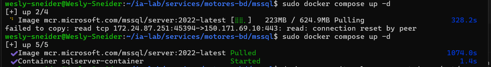

## 6. Paso 5: SQL Server

### 6.1 Crear docker-compose.yml

``` bash
cat > ~/ia-lab/services/motores-bd/mssql/docker-compose.yml << 'EOF'
services:
  mssql:
    image: mcr.microsoft.com/mssql/server:2022-latest
    container_name: mssql-server
    restart: unless-stopped
    user: root
    env_file:
      - .env
    ports:
      - "1433:1433"
    volumes:
      - ../../../data/mssql:/var/opt/mssql
      - /mnt/c/academia/bd:/backups
    networks:
      - ia-lab-network
    healthcheck:
      test: ["CMD-SHELL", "/opt/mssql-tools18/bin/sqlcmd -S localhost -U sa -P \"$$MSSQL_SA_PASSWORD\" -C -Q 'SELECT 1' || exit 1"]
      interval: 15s
      timeout: 10s
      retries: 6
      start_period: 40s

networks:
  ia-lab-network:
    external: true
EOF
```

### 6.2 Crear .env

``` bash
cat > ~/ia-lab/services/motores-bd/mssql/.env << 'EOF'
TZ=America/Bogota
ACCEPT_EULA=Y
MSSQL_SA_PASSWORD=Wesly123
MSSQL_PID=Developer
EOF
```

### 6.3 Crear README.md

``` bash
cat > ~/ia-lab/services/motores-bd/mssql/README.md << 'EOF'
# SQL Server 2022 - Motor de Base de Datos

> **Acceso remoto habilitado.** Puerto expuesto en `0.0.0.0:1433`.
> **Usuario por defecto:** `SA` (acceso remoto: habilitado por defecto)
EOF
```
-------------------------------------------------------------------------------------------------------------------------------------

## Conectar desde WSL (local)

```bash
docker exec -it mssql-server /opt/mssql-tools18/bin/sqlcmd -S localhost -U sa -P 'Wesly123' -C
```

## Conectar remotamente desde cualquier equipo

``` bash
sqlcmd -S 172.24.87.251,1433 -U SA -P 'Wesly123'
```

O con cliente grafico (Azure Data Studio, DBeaver, SSMS): - **Host:** `172.24.87.251` - **Port:** `1433` - **User:** `SA` - **Password:** `Wesly123`

## Crear un usuario PROPIO con ACCESO REMOTO

``` sql
-- Crear la base de datos
CREATE DATABASE puntostock;
GO

-- Crear login (autenticacion a nivel servidor, acceso remoto por defecto)
CREATE LOGIN wesly_login WITH PASSWORD = 'Wesly123';
GO

-- Crear usuario dentro de la base de datos
USE puntostock;
GO
CREATE USER wesly FOR LOGIN wesly_login;
GO

-- Dar permisos de dueno de la base de datos
ALTER ROLE db_owner ADD MEMBER wesly;
GO
```

## Backup de una base de datos

``` bash
docker exec mssql-server /opt/mssql-tools18/bin/sqlcmd -S localhost -U SA -P 'sqlServer1433' -C -Q "BACKUP DATABASE [enlace_express] TO DISK = N'/backups/backup_mssql_enlace_express_$(date +%Y%m%d).bak'"
```

## Variables clave del .env

| Variable            | Descripcion                             |
|---------------------|-----------------------------------------|
| `MSSQL_SA_PASSWORD` | Password del usuario SA (administrador) |
| `MSSQL_PID`         | Edicion de SQL Server (Developer)       |        

### 6.4 Levantar SQL Server

```bash
cd ~/ia-lab/services/motores-bd/mssql
docker compose up -d
```

Verificar que está corriendo:

``` bash
docker ps | grep mssql-server
docker logs mssql-server --tail 20
```

<p align="center">
  
</p>