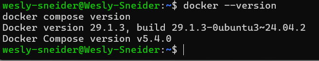
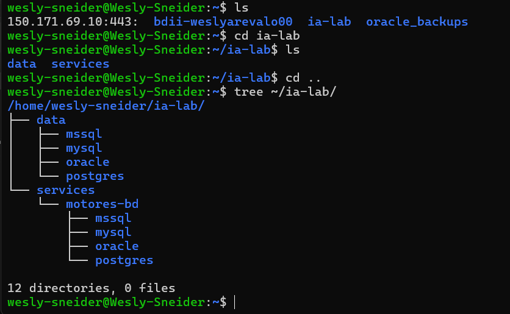
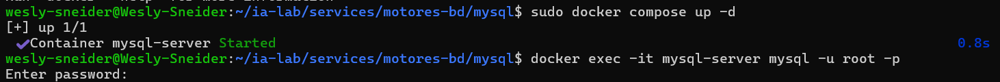

# Semana 1: Configuración de Infraestructura con Docker Compose

## 1. Requisitos Previos

- WSL2 instalado y funcionando
- Docker funcionando dentro de WSL
- Acceso a terminal bash en WSL

Verifica Docker:

``` bash
docker --version
docker compose version
```

<p align="center">
  
</p>

---------------------------------------------------------------------------------------------

## 2. Paso 1: Crear Carpetas

Abre tu terminal WSL y ejecuta:

``` bash
mkdir -p ~/ia-lab/services/motores-bd/{mysql,postgres,mssql,oracle}
mkdir -p ~/ia-lab/data/{mysql,postgres,mssql,oracle}
```

Verifica la estructura:

``` bash
tree ~/ia-lab/
```

<p align="center">
  
</p>

---------------------------------------------------------------------------------------------

## 3. Paso 2: Crear la Red Docker Compartida

Todos los contenedores compartirán una misma red Docker para comunicarse entre sí:

``` bash
docker network inspect ia-lab-network >/dev/null 2>&1 || docker network create ia-lab-network
```

Verifica que se creó:

``` bash
docker network ls | grep ia-lab
```

<p align="center">
  
</p>

---------------------------------------------------------------------------------------------

## 4. Paso 3: MySQL

### 4.1 Crear el archivo docker-compose.yml

``` bash
cat > ~/ia-lab/services/motores-bd/mysql/docker-compose.yml << 'EOF'
services:
  mysql:
    image: mysql:8.0
    container_name: mysql-server
    restart: unless-stopped
    env_file:
      - .env
    ports:
      - "3307:3306"
    volumes:
      - ../../../data/mysql:/var/lib/mysql
      - /mnt/c/academia/bd:/backups
    command: >
      --character-set-server=utf8mb4
      --collation-server=utf8mb4_unicode_ci
      --bind-address=0.0.0.0
    networks:
      - ia-lab-network
    healthcheck:
      test: ["CMD", "mysqladmin", "ping", "-h", "localhost"]
      interval: 10s
      timeout: 5s
      retries: 5
      start_period: 30s

networks:
  ia-lab-network:
    external: true
EOF
```

### 4.2 Crear el archivo .env

``` bash
cat > ~/ia-lab/services/motores-bd/mysql/.env << 'EOF'
TZ=America/Bogota
MYSQL_ROOT_PASSWORD=123456
MYSQL_DATABASE=puntostock
EOF
```

### 4.3 Crear README.md

``` bash
cat > ~/ia-lab/services/motores-bd/mysql/README.md << 'EOF'
# MySQL 8.0 - Motor de Base de Datos

> **Acceso remoto habilitado.** Puerto expuesto en `0.0.0.0:3306`.
> **Usuario por defecto:** `root` (acceso remoto: `%`)

## Conectar desde WSL (local)

```bash
docker exec -it mysql-server mysql -u root -p
# Password: 123456
EOF
```

---

## Conectar desde WSL (local)

```bash
docker exec -it mysql-server mysql -u root -p
# Password: 123456
```

## Conectar remotamente desde cualquier equipo

Reemplaza `IP_SERVIDOR` por la IP de la maquina WSL:

``` bash
mysql -h 172.24.87.251 -P 3307 -u root -p
```

O con cliente grafico (MySQL Workbench, DBeaver, HeidiSQL): - **Host:** `172.24.87.251` - **Port:** `3307` - **User:** `root` - **Password:** `123456`

## Crear un usuario PROPIO con ACCESO REMOTO

Conectate primero como root, luego ejecuta:

``` sql
-- Crear usuario propio con acceso desde CUALQUIER equipo (%)
CREATE USER 'wesly_mysql'@'%' IDENTIFIED BY '123456';

-- Dar permisos sobre la base de datos
GRANT ALL PRIVILEGES ON puntostock.* TO 'wesly_mysql'@'%';
FLUSH PRIVILEGES;
```

## Backup de una base de datos

``` bash
docker exec mysql-server mysqldump -u root -pweslyMySQL3307 puntostock > /mnt/c/academia/bd/backup_mysql_puntostock_$(date +%Y%m%d).sql
```

## Variables clave del .env

| Variable              | Descripcion                                      |
|-----------------------|--------------------------------------------------|
| `MYSQL_ROOT_PASSWORD` | Password del usuario root                        |
| `MYSQL_DATABASE`      | Base de datos creada automaticamente al arrancar |        

### 4.4 Levantar MySQL

```bash
cd ~/ia-lab/services/motores-bd/mysql
docker compose up -d
```

Verificar que está corriendo:

``` bash
docker ps | grep mysql-server
docker logs mysql-server --tail 20
```

<p align="center">
  
</p>