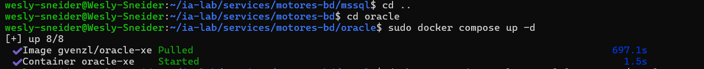

## 7. Paso 6: Oracle XE

### 7.1 Crear docker-compose.yml

``` bash
cat > ~/ia-lab/services/motores-bd/oracle/docker-compose.yml << 'EOF'
services:
  oracle:
    image: gvenzl/oracle-xe:21-slim
    container_name: oracle-xe
    restart: unless-stopped
    env_file:
      - .env
    ports:
      - "1521:1521"
      - "8080:8080"
    volumes:
      - ../../../data/oracle:/opt/oracle/oradata
      - /mnt/c/academia/bd:/backups
    networks:
      - ia-lab-network
    healthcheck:
      test: ["CMD", "healthcheck.sh"]
      interval: 15s
      timeout: 10s
      retries: 10
      start_period: 90s

networks:
  ia-lab-network:
    external: true
EOF
```

### 7.2 Crear .env

``` bash
cat > ~/ia-lab/services/motores-bd/oracle/.env << 'EOF'
TZ=America/Bogota
ORACLE_PASSWORD=Wesly123
ORACLE_DATABASE=puntostock
EOF
```

### 7.3 Crear README.md

``` bash
cat > ~/ia-lab/services/motores-bd/oracle/README.md << 'EOF'
# Oracle XE - Motor de Base de Datos

> **Acceso remoto habilitado.** Puerto expuesto en `0.0.0.0:1521`.
> **Usuario por defecto:** `SYSTEM` (acceso remoto: habilitado via listener)
>
> **⚠️ Estado actual:** Este contenedor puede tener problemas de inicializacion en WSL.
> La imagen `gvenzl/oracle-xe` requiere configuracion adicional.
EOF
```
--------------------------------------------------------------------------------

## Conectar desde WSL (local)

```bash
docker exec -it oracle-xe sqlplus system/Wesly123@XEPDB1
```

## Conectar remotamente desde cualquier equipo

``` bash
sqlplus system/Wesly123@//172.24.87.251:1521/XEPDB1
```

O con cliente grafico (SQL Developer, DBeaver): - **Host:** `172.24.87.251` - **Port:** `1521` - **Service Name:** `XEPDB1` - **User:** `SYSTEM` - **Password:** `Wesly123`

## Crear un usuario PROPIO con ACCESO REMOTO

``` sql
-- Crear tablespace para el usuario
CREATE TABLESPACE mi_ts DATAFILE '/opt/oracle/oradata/XE/XEPDB1/mi_ts.dbf' SIZE 100M AUTOEXTEND ON;

-- Crear usuario propio (puede conectarse desde cualquier host via listener)
CREATE USER puntostock IDENTIFIED BY Wesly123 DEFAULT TABLESPACE mi_ts QUOTA UNLIMITED ON mi_ts;

-- Dar permisos basicos
GRANT CREATE SESSION, CREATE TABLE, CREATE VIEW, CREATE SEQUENCE, CREATE TRIGGER TO puntostock;

-- Opcional: dar permisos de DBA
GRANT DBA TO puntostock;
```

## Variables clave del .env

| Variable          | Descripcion                 |
|-------------------|-----------------------------|
| `ORACLE_PASSWORD` | Password del usuario SYSTEM |
| `ORACLE_DATABASE` | Nombre de la instancia (XE) |         

### 7.4 Levantar Oracle

```bash
cd ~/ia-lab/services/motores-bd/oracle
docker compose up -d
```

Verificar que está corriendo:

``` bash
docker ps | grep oracle-xe
docker logs -f oracle-xe
```

<p align="center">
  
</p>

------------------------------------------------------------------------

**Autor:** Wesly Arévalo\
**Version:** 1.0\
**Fecha:** 2026-08-12